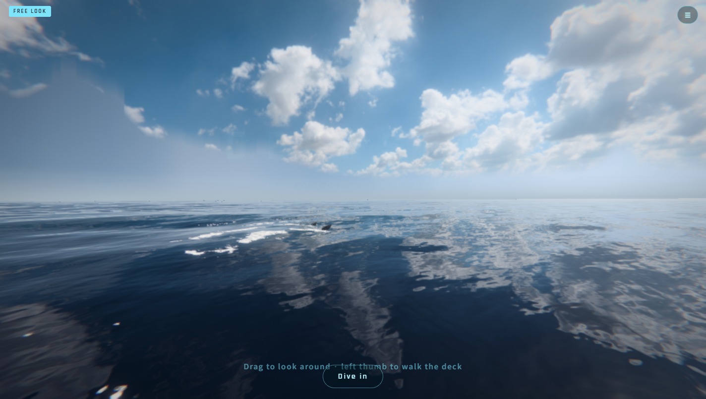

# DEEPSEA — Abyssal Descent

**Play:** https://daforce1984.github.io/deepsea/ (Chrome / Edge with WebGPU; phones supported)  
**Source:** https://github.com/daforce1984/deepsea

A photoreal first-person dive from a boat deck down to the 4,000 m abyssal plain, running on a custom
WebGPU / WGSL engine written from scratch (no three.js, no game engine) — about 8,000 lines of JavaScript + WGSL.
Built with **Claude Opus 5.5** in Claude Code.



## Highlights
- **Ocean:** GPU FFT ocean (Tessendorf, 3 cascades × 256²), HDRI sky, GPU foam simulation (262k particles) that merges and tears,
  bubble plumes that rise and feed surface foam.
- **Humpback lobtail:** spring-driven body bend, one tail slap over the fluke's real footprint,
  up to 400k spray drops simulated in a compute shader, drop-rain sound from real water-drop grains in an AudioWorklet.
- **Depth-driven light:** Jerlov clear-ocean absorption (red gone by 10 m, blue by 250 m), adaptive exposure, torch with shadows.
- **Encounters by depth:** dolphins, bait ball, mantas, sharks, turtle, oarfish, megalodon, giant squid, siphonophores,
  anglerfish, grenadiers on the floor — big animals shed wake vortices that swirl the marine snow.
- **Audio:** HRTF spatial sound on deck and underwater, helmet breathing, depth call-outs.
- **Mobile:** touch stick, gyroscope look, portrait or landscape.

## Controls
Desktop: WASD swim · E/Q down/up · Shift boost · F torch · Space wrist gauge / dive in · Enter cinematic descent ·
V free look · L English/한국어 · ` debug event panel.
Mobile: left thumb to move, drag or turn the phone to look, on-screen buttons.

## Run locally
```
python3 tools/serve.py 8795   # then open http://localhost:8795/index.html
```

## Credits
3D models are CC-BY 4.0 / CC0 (see `assets/models/*/SOURCES.txt`), sky HDRI from Poly Haven (CC0),
sounds from Pixabay (see `assets/audio/SOURCES*.txt`).
